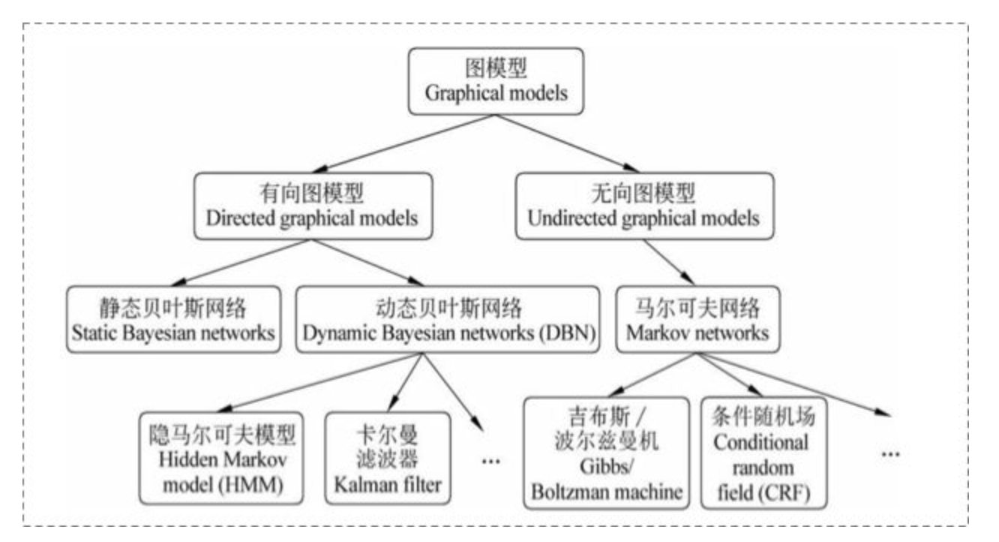
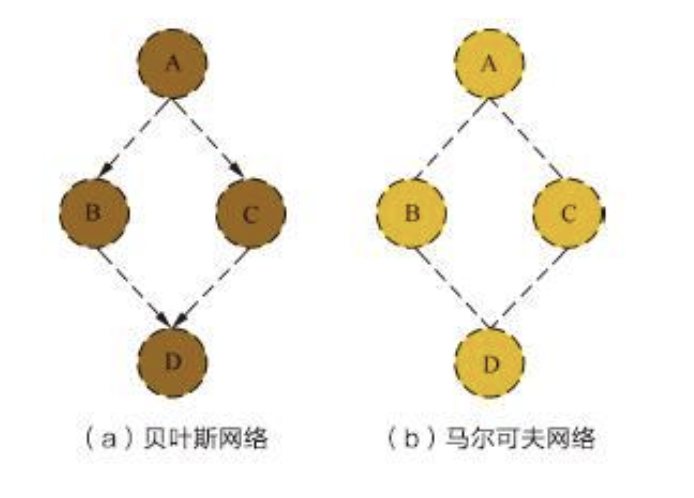

# 概率图模型

## 1. 概述
概率图模型(probabilistic graph model): 是用图来表达变量相关关系的概率模型。节点表示一个或一组随机变量，边表示随机变量直接的关系，节点分为观测节点和隐含节点，边分为有向边和无向边。

概率图模型分为：
```
有向图 ->  贝叶斯网络
无向图 ->  马尔科夫网络
```
更详细的分类如下图所示：



## 2. 概率图模型中的联合概率分布

下图是贝叶斯网络和马尔科夫网络的示例图，写出其联合概率分布



### 2.1 贝叶斯网络的联合概率分布

贝叶斯网络是有向图, 边的指向代表是依赖关系,根据其指向可以简单的写成联合概率分布:

$$P(A,B,C,D) = P(A)P(B|A)P(C|A)P(D|B,C)$$

### 2.2 马尔科夫网络的联合概率分布

如上图的马尔科夫网络中，对于任意有边连接的节点，则可以组成团,**最大团**即图中的极大连通子图，任意两个节点之间都有边的连接。马尔科夫网络的联合概率分布可分解:

$$P(x) = \frac{1}{Z}\prod_{Q\in{C}}U_Q(x_Q)$$
其中$C$是极大团的集合，$U_Q$是极大团对应的势函数，$Z=\sum_x\prod_{Q\in{C}}U_Q(x_Q)$为归一化因子。

势函数是$U_Q(x_Q)$是刻画变量集$X_Q$中变量直接的关系，是非负函数，且所偏好的变量取值上有较大的的函数值。

$$
\begin{aligned}
    U_Q(x_Q) &= e^{-H_Q(X_Q)} \\
    H_Q(X_Q) &= \sum_{u,v\in{Q}}\alpha_{uv}x_ux_v + \sum_{v\in{Q}} \beta x_v  \qquad 前者是两对节点，后者是一个节点关系
\end{aligned}
$$


## 3. 隐马尔可夫模型

## 4. 最大熵马尔科夫模型

## 5. 条件随机场


## 参考资料
- 百面机器学习
- [概率图模型体系：HMM、MEMM、CRF](https://zhuanlan.zhihu.com/p/33397147)
- 统计机器学习
- 机器学习


