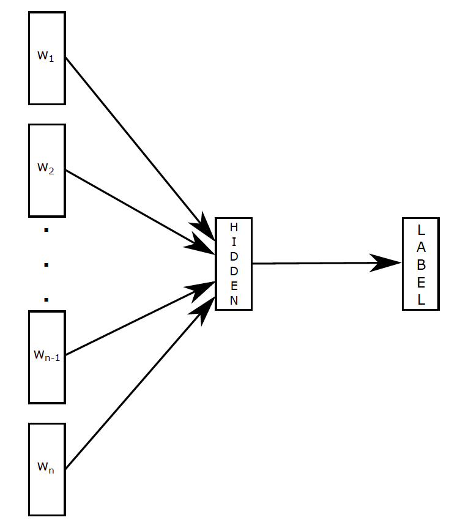

# fastText-快速文本分类模型

## 1. 模型结构

- 输入层:  $X$  维度为  batch * seq_len  
- 输入层到隐含层的矩阵W: V* K， V是词表的维度，K,embedding维度
- X进行embedding后，维度： batch * seq_len * N
- hidden : batch * N:  对所有当前句子进行平均
- 输出层矩阵$W'$: K * classes, classes为类别的个数

## 2. 分层softmax

从上图可以看到，输出层输出的是一个k维的向量，通常需要将k维向量进行softmax, 如下所示，样本属于类别的概率为: 

$$p(x_i) = \frac{e^{x_i}}{\sum_i{e^{x_i}}}$$

代价函数是交叉熵损失,即两个分布的差距，y为真实分布，$h(x)$为预测的分布:

$$J = -y_i.log(h(x_i))$$

从上述可以看到，当计算$p(y=j)$即标签为j的概率时，因为softmax函数的原因，需要对K个概率进行归一化，因此当输出结果K的维度很大时，是非常耗时的。于是，分层Softmax诞生了，它的基本思想是使用树的层级结构替代扁平化的标准Softmax。
使得在计算$p(y=j)$ 时，只需计算一条路径上的所有节点的概率值，无需在意其它的节点。

树的结构是根据类标的频数构造的霍夫曼树。K个不同的类标组成所有的叶子节点，K-1个内部节点作为内部参数，从根节点到某个叶子节点经过的节点和边形成一条路径.

通过分层的Softmax，计算复杂度一下从|K|降低到log|K|。

## 3. N-gram 特征

fastText加入了n-gram特征作为输入，注意n-gram分为字符级别和词级别。

## 4. 训练

